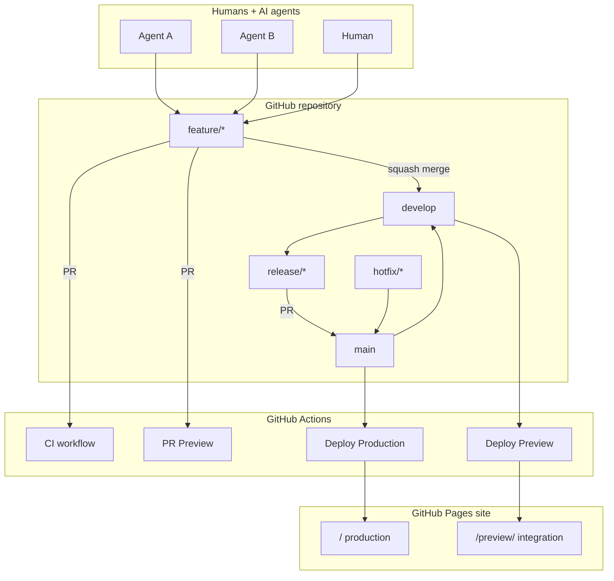
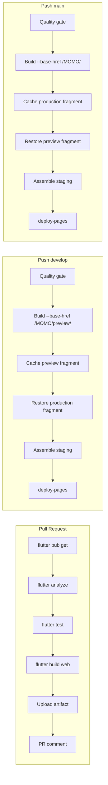

# Architecture & pipeline diagrams

## 1. Repository architecture (runtime + delivery)



## 2. Branch strategy diagram

```text
feature/* ──────────────┐
                        │ PR + CI + PR Preview
                        ▼
                   ┌─────────┐
                   │ develop │──── Deploy Preview ──► /preview/
                   └────┬────┘
                        │ release/*
                        ▼
                   ┌─────────┐
                   │  main   │──── Deploy Production ► /
                   └────┬────┘
                        │
                   hotfix/* (cut from main, merge back to develop)
```

See also: [`GIT_FLOW.md`](GIT_FLOW.md)

## 3. CI/CD pipeline diagram



## 4. Quality checks on every workflow

```text
┌──────────────┐   ┌──────────────┐   ┌──────────────┐   ┌──────────────┐
│ Flutter cache│ → │  pub get     │ → │ analyze+test │ → │ build web    │
└──────────────┘   └──────────────┘   └──────────────┘   └──────┬───────┘
                                                                │
                     ┌────────────────┬─────────────────────────┘
                     ▼                ▼
              Upload artifact   Failure notify
              (CI / PR / deploy)  (summary + PR comment / ::error)
```
