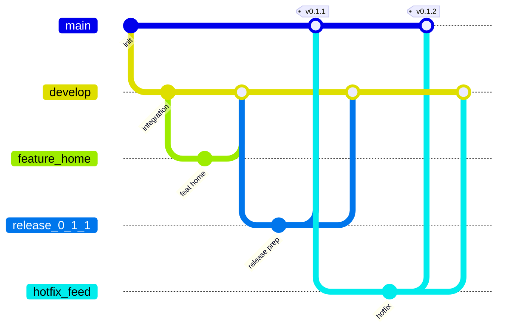

# Git Flow — MOMO

## Branch strategy diagram

```text
                     ┌──────────────┐
                     │ hotfix/*     │── PR ──► main ──► develop
                     └──────────────┘

feature/a ─┐
feature/b ─┼─ PR (squash) ─► develop ─► Deploy Preview (/preview/)
feature/c ─┘                     │
                                 │
                          release/x.y.z ─ PR ─► main ─► Deploy Production
                                 │
                                 └── merge back ─► develop
```



## Rules

### `main` (production)

- Protected.
- Only accepts PRs from `release/*` or `hotfix/*` (or admin emergency).
- Every push triggers **Deploy Production**.
- Must always be releasable.

### `develop` (integration)

- Protected.
- Default PR target for `feature/*`.
- Every push triggers **Deploy Preview** (stable URL).
- May be briefly unstable during heavy integration — still must stay CI-green.

### `feature/*`

- One topic per branch.
- Prefer folder ownership (see [`docs/AI_AGENTS.md`](../AI_AGENTS.md)).
- Open PR → `develop`.
- Delete branch after squash-merge.

### `release/*`

- Cut from `develop` when preparing a production ship.
- Only bugfixes, version bumps, release notes.
- PR → `main`, then merge `main` back into `develop` (or merge the release branch into both).

### `hotfix/*`

- Cut from `main`.
- PR → `main`, then immediately merge/cherry-pick into `develop`.

## Merge strategy

| Path | Strategy | Why |
|------|----------|-----|
| `feature/*` → `develop` | **Squash merge** | Clean develop history; one commit per feature |
| `release/*` → `main` | Merge commit or squash | Prefer merge commit if you want release branch topology |
| `hotfix/*` → `main` | Squash or merge | Fast, clear |
| `main` → `develop` (sync) | Merge commit | Preserve hotfix lineage |

Enable in GitHub: Settings → General → Pull Requests → allow squash merging (default).

## Conflict reduction

1. Keep features small (< 1–2 days of work / one agent session).
2. Rebase or merge `develop` into your feature daily.
3. Avoid editing `pubspec.yaml`, `CODEOWNERS`, or workflows unless your task owns them.
4. Prefer additive files over rewriting shared screens.
5. Run CI locally before push.
